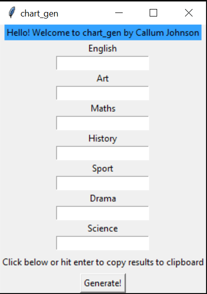

# test-score-rose-generator

This Repository began as a project designed for use specifically with a single tutoring company, however this code has been made public in the interest of sharing the benefits of this work with people who may find use in it.

A rose chart is a novel way to present test scores, and is very visually intuitive and useful for exhibiting student changes across one term to the next. An example is shown below:


Intuitively the student's percentage score is shaded to fill the same percentage of that subject slice. This method has been used in
the past using Microsoft Excel templates, however results and formatting can be inconsistent due to necessary human placement of labels.

## Purpose
The aims of this project are to:

- Exhibit a novel way of presenting test scores for students.
- Develop a user-friendly interface accessible to all teachers and tutors.
- Improve tutor image by bringing a new level of professionalism to employee-client interactions.

----
## Directory

- `assets`: Contains images and sources required for the project.
- `code`: Contains all code used in the project.
- `executable`: Contains the generated 'chart_gen' standalone and all necessary components. Currently only Windows is supported.
- `plots`: Contains generated plots and charts.

----

## How to use

Global settings such names of subjects and marks available can be edited within the source code, and are generally stored as
global variables for ease of access. An overall config file has been planned for future versions.

The interface can be accessed in one of two ways:
 - Python Users: Simly navigate to the 'code' folder, and open python. Then run the following lines of code:
   ```
   from gui import main

   main()
   ```
 - Non-Python Users: Navigate to the 'executable' folder, and double click 'chart_gen.exe' to run the application.

The following GUI should open



Once running, input your test scores as either whole numbers or percentages. When you hit 'generate', the resulting rose
chart will be copied to your clipboard as well as saved locally.

----
## Known issues / TODO

TODO:
- Incorporate Percentage Changes into output
  - Add negative arrows for negative % changes.
  - Add slider scale for overall score.
- Generate config .yaml file for improved application to other projects.
- Add support for Mac OS Users
